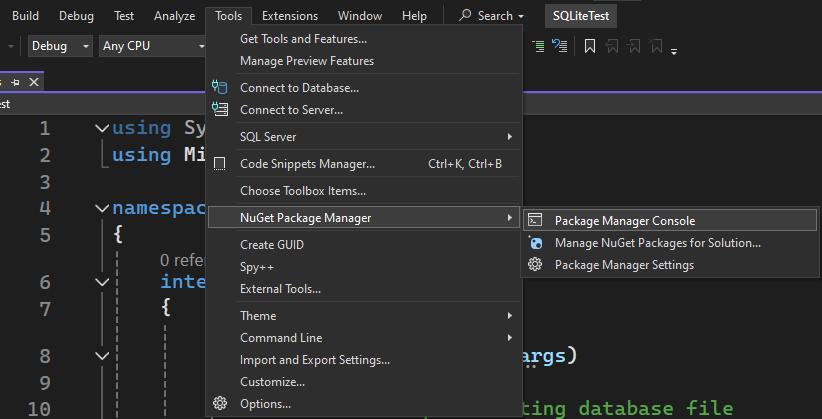
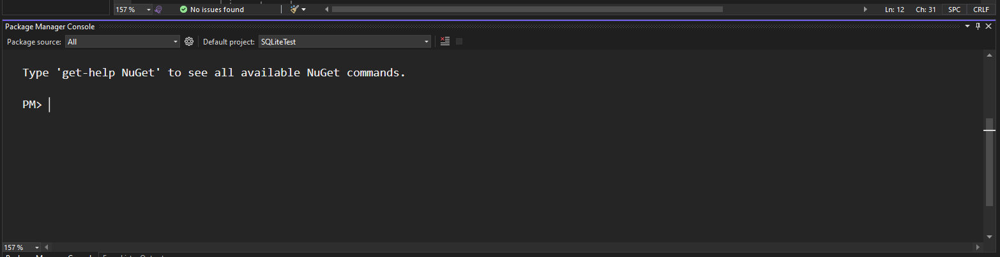

# Свързване на програмата с локална база данни SQLite

## Изтегляне на библиотеката [Microsoft.Data.Sqlite](https://learn.microsoft.com/en-us/dotnet/standard/data/sqlite/?tabs=visual-studio)

Отваряме *Package Manager Console* от: 
```Tools > NuGet Package Manager > Package Manager Console```





Пишем командата: 
```
Install-Package Microsoft.Data.Sqlite
```

## Свързване

```cs
SqliteConnection connection = new SqliteConnection("Data Source=database.db"); // name of file

connection.Open();
```

## Място на съхранение на базата данни

Базата данни се съхранява като файл. В този случай може да го намерим в 
```
(Директория на проект)\bin\Debug\net8.0\database.db
```
Разширението на файла завършва с **.db**
Може да го отворим с различни инструменти като най-лесен пример:
- Да използваме extension на **Visual Studio Code**
- Да използваме уеб инструмент като [SQLite Viewer](https://sqliteviewer.app/)

## Създаване на таблица

След свързването продължаваме, като създаваме таблицата, ако не съществува. Затова може да добавим "IF NOT EXISTS" след "CREATE TABLE":

```cs
SqliteCommand createTableCommand = connection.CreateCommand();
createTableCommand.CommandText = 
@"CREATE TABLE IF NOT EXISTS users (
id INTEGER NOT NULL PRIMARY KEY AUTOINCREMENT,
username TEXT,
email TEXT,
password TEXT);";
createTableCommand.ExecuteNonQuery();
```

## Добавяне на нов запис

Като имаме готова таблица **users** може да добавим нови записи или потребители в нашия случай. Използваме така наречени **placeholders**, за да избегнем [SQL Inject](https://www.w3schools.com/sql/sql_injection.asp) атаките. Например "@uname", "@email", "@pass":

```cs
SqliteCommand insertCommand = connection.CreateCommand();
insertCommand.CommandText = 
@"INSERT INTO users(username, email, password)
VALUES(@uname, @email, @pass);";

Console.Write("Please enter name to insert: ");
insertCommand.Parameters.AddWithValue("@uname", Console.ReadLine());

Console.Write("Please enter email to insert: ");
insertCommand.Parameters.AddWithValue("@email", Console.ReadLine());

Console.Write("Please enter password to insert: ");
insertCommand.Parameters.AddWithValue("@pass", Console.ReadLine());

insertCommand.ExecuteNonQuery();
```

## Извличане на данни

```cs
SqliteCommand selectCommand = connection.CreateCommand();
selectCommand.CommandText = 
@"SELECT username, email, password 
FROM users 
WHERE username = @name";

Console.Write("Please enter name to search: ");
selectCommand.Parameters.AddWithValue("@name", Console.ReadLine());

SqliteDataReader reader = selectCommand.ExecuteReader();

while (reader.Read())
{
    string userName = reader.GetString(0);
    string userEmail = reader.GetString(1);
    string userPassword = reader.GetString(2);

    Console.WriteLine("Hello, " + userName + "!");
    Console.WriteLine("Your email is " + userEmail);
    Console.WriteLine("Your password is " + userPassword);
}

reader.Close();
```

## Пример с UPDATE заявка

```cs
SqliteCommand updateCommand = connection.CreateCommand();
updateCommand.CommandText = 
@"UPDATE users SET email = @email 
WHERE username = @username";

Console.Write("Enter name to change email: ");
updateCommand.Parameters.AddWithValue("@username", Console.ReadLine());

Console.Write("Enter new email: ");
updateCommand.Parameters.AddWithValue("@email", Console.ReadLine());
updateCommand.ExecuteNonQuery();
```

